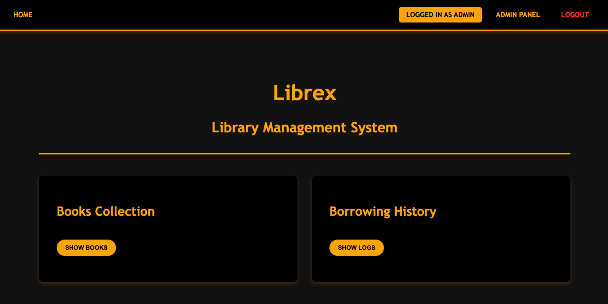

---

# Librex - Library Management System

**Librex** is a full-stack Library Management System that allows users to view available books and their borrow logs publicly, while giving administrators the ability to manage books and borrow logs via an intuitive admin panel.

## Features

- **Frontend (React):**
    - Public view of the book list and borrow log.
    - Admin panel for managing books and borrow logs (add/remove) once logged in.

- **Backend (Spring Boot):**
    - Uses JPA (PostgreSQL) repositories for books and users.
    - Uses MongoDB repository for borrow logs.
    - Implements Spring Security for secure access.
    - Organized using a clear structure: `config`, `controller`, `dto`, `entity`, `repository`, `security`, and `service` packages.

## Installation

### Prerequisites

- **Backend:** Java 21, PostgreSQL database, MongoDB database.
- **Frontend:** Node.js and npm.

### Backend Setup

1. Navigate to the project root and ensure your backend source files are located under the `src/` folder.
2. Build and run the Spring Boot application (which uses embedded Tomcat) on port `8080`:
   ```bash
   # From the project root (or configure your IDE to run the Spring Boot app)
   ./mvnw spring-boot:run
   ```
3. The backend login endpoint is available at: [http://localhost:8080/login](http://localhost:8080/login).

### Frontend Setup

1. Navigate to the `frontend/` directory:
   ```bash
   cd frontend
   ```
2. Install dependencies:
   ```bash
   npm install
   ```
3. Start the React development server:
   ```bash
   npm start
   ```
4. The frontend will be accessible at [http://localhost:3000](http://localhost:3000) (or the port specified by your React configuration).

## Usage

- **Public Users:**  
  Visit the frontend URL to view the available books and the borrow log, which displays details on the availability and borrowing history of each book.

- **Admin Users:**  
  After logging in via the provided login endpoint, admins can access the admin panel from the frontend to add or remove books and update borrow logs.

## Screenshots

Here are a few screenshots of key pages in the application:

- **Home Page:**


  


- **Login Page:**


  


- **Admin Page:**


  

## Contribution

This is a work-in-progress personal project. Contributions, suggestions, and feedback for improvements are welcome!

---